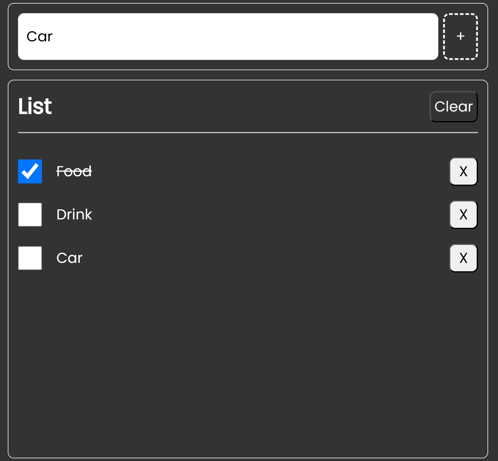

# Lesson 10 Vite TypeScript List App

This project is a simple list app built with Vite and TypeScript, designed to help you understand the basics of using Vite for bundling and serving a TypeScript application. The app allows users to manage a list with items.

## Demo

