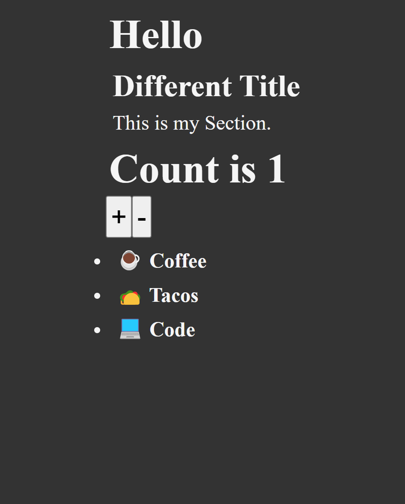

# Lesson 12 - React TypeScript Project

This project is a React application built with TypeScript, demonstrating component-based architecture and basic functionality. It serves as a learning example for Lesson 11, focusing on React components, TypeScript integration, and application structure.

## Features

- **Counter**: A component demonstrating state management with increment/decrement functionality
- **Heading**: A reusable component for displaying headings
- **List**: A component for rendering lists of items
- **Section**: A wrapper component for organizing content sections

## Demo

